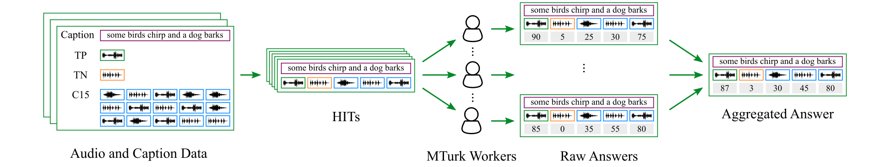

# TAU Audio-Text Graded Relevances 2023 Dataset

This repository provides data and instructions for crowdsourcing text-based audio retrieval relevances on Amazon Mechanical Turk (MTurk).
More details about the entire crowdsourcing task settings and the usage of the crowdsourced audio-text relevances can be found in our paper (available on [arXiv](https://arxiv.org/abs/2306.09820)):

```
@InProceedings{Xie2023Crowdsourcing,
    author = {Xie, Huang and Khorrami, Khazar and Räsänen, Okko and Virtanen, Tuomas},
    title = {{Crowdsourcing and Evaluating Text-Based Audio Retrieval Relevances}},
    booktitle = {Proc. Detect. Classif. Acoust. Scenes Events Work. (DCASE)},
    year = {2023},
    pages = {226-230}
}
```

## Crowdsourcing Task Pipeline



Given a free-form text (e.g., a caption) as a query, crowdworkers are asked to grade audio clips using numeric scores (between 0 and 100) to indicate their judgements of how much the sound content of an audio clip matches the text, where 0 indicates no content match at all and 100 indicates perfect content match.

## Audio and Text Data

The text queries and audio clips used for crowdsourcing relevance judgements are selected from Clotho [](https://doi.org/10.5281/zenodo.4783391).

## Repository Structure

```
repository root
├─data
│  ├─audio_metadata             # Clotho audio metadata
│  ├─query_data                 # text queries, with a list of audio files per each
│  ├─relevance_data             # crowdsourced audio-text relevances
│  ├─text_data                  # Clotho audio captions
│  └─task_input_example.csv     # example input for crowdsourcing tasks
│
├─figs                          # figures
│
├─mturk_api                     # Boto3 functions (e.g., creating qualification tests)
│
├─mturk_task
│  ├─html                       # task webpage template
│  └─xml                        # qualification test template
│
├─README.md                     # README
└─requirements.txt              # required python packages
```

## Getting Started

This codebase is developed with Python 3.9 and [Boto3 1.24.28](https://boto3.amazonaws.com/v1/documentation/api/latest/index.html).
You can check out the repository and install required python packages with the following commands:

```
git clone https://github.com/xieh97/retrieval-relevance-crowdsourcing.git
pip install -r requirements.txt
```
